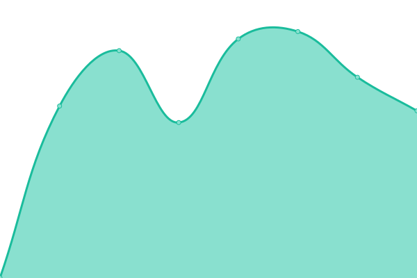
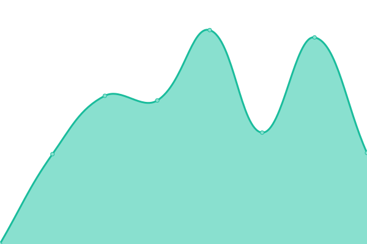

# [📈 Live Status](https://status.codeskraps.com): <!--live status--> **🟩 All systems operational**

This repository contains the open-source uptime monitor and status page for [Carles Sentis](http://codeskraps.com), powered by [Upptime](https://github.com/upptime/upptime).

With [Upptime](https://upptime.js.org), you can get your own unlimited and free uptime monitor and status page, powered entirely by a GitHub repository. We use [Issues](https://github.com/codeskraps/upptime_codeskraps_status/issues) as incident reports, [Actions](https://github.com/codeskraps/upptime_codeskraps_status/actions) as uptime monitors, and [Pages](https://status.codeskraps.com) for the status page.

<!--start: status pages-->
<!-- This summary is generated by Upptime (https://github.com/upptime/upptime) -->
<!-- Do not edit this manually, your changes will be overwritten -->
<!-- prettier-ignore -->
| URL | Status | History | Response Time | Uptime |
| --- | ------ | ------- | ------------- | ------ |
|  [codeskraps.com](https://codeskraps.com) | 🟩 Up | [codeskraps-com.yml](https://github.com/codeskraps/upptime_codeskraps_status/commits/HEAD/history/codeskraps-com.yml) | 

 464ms
     
 | 

<a href="https://status.codeskraps.com/history/codeskraps-com">100.00%</a>
    

|  [Tracks](https://tracks.codeskraps.com) | 🟩 Up | [tracks.yml](https://github.com/codeskraps/upptime_codeskraps_status/commits/HEAD/history/tracks.yml) | 

 564ms
     
 | 

<a href="https://status.codeskraps.com/history/tracks">67.93%</a>
    

|  [Repo](https://repo.codeskraps.com/codeskraps) | 🟩 Up | [repo.yml](https://github.com/codeskraps/upptime_codeskraps_status/commits/HEAD/history/repo.yml) | 

 551ms
     
 | 

<a href="https://status.codeskraps.com/history/repo">100.00%</a>
    

|  [Umami Dashboard](https://umami.codeskraps.com/dashboard) | 🟩 Up | [umami-dashboard.yml](https://github.com/codeskraps/upptime_codeskraps_status/commits/HEAD/history/umami-dashboard.yml) | 

 514ms
     
 | 

<a href="https://status.codeskraps.com/history/umami-dashboard">68.11%</a>
    

|  [Chhoto URL](https://short.codeskraps.com) | 🟩 Up | [chhoto-url.yml](https://github.com/codeskraps/upptime_codeskraps_status/commits/HEAD/history/chhoto-url.yml) | 

 448ms
     
 | 

<a href="https://status.codeskraps.com/history/chhoto-url">68.11%</a>
    

|  [Mining Worker GAMMA_ONE](https://public-pool.io:40557/api/client/bc1qly6qksz72l3l8v7ugsvekf384a3xdysdr886z4) | 🟩 Up | [mining-worker-gamma-one.yml](https://github.com/codeskraps/upptime_codeskraps_status/commits/HEAD/history/mining-worker-gamma-one.yml) | 

 507ms
     
 | 

<a href="https://status.codeskraps.com/history/mining-worker-gamma-one">100.00%</a>
    

|  [Jellyfin Escolt](https://escolt.eu) | 🟩 Up | [jellyfin-escolt.yml](https://github.com/codeskraps/upptime_codeskraps_status/commits/HEAD/history/jellyfin-escolt.yml) | 

 693ms
     
 | 

<a href="https://status.codeskraps.com/history/jellyfin-escolt">100.00%</a>
    

|  [Jellyfin TV Escolt](https://tv.escolt.eu) | 🟩 Up | [jellyfin-tv-escolt.yml](https://github.com/codeskraps/upptime_codeskraps_status/commits/HEAD/history/jellyfin-tv-escolt.yml) | 

 777ms
     
 | 

<a href="https://status.codeskraps.com/history/jellyfin-tv-escolt">100.00%</a>
    

|  [LibrePhotos Escolt](https://photos.escolt.eu) | 🟩 Up | [libre-photos-escolt.yml](https://github.com/codeskraps/upptime_codeskraps_status/commits/HEAD/history/libre-photos-escolt.yml) | 

 549ms
     
 | 

<a href="https://status.codeskraps.com/history/libre-photos-escolt">100.00%</a>
    

|  [Freqtrade Escolt](https://trade.escolt.eu) | 🟩 Up | [freqtrade-escolt.yml](https://github.com/codeskraps/upptime_codeskraps_status/commits/HEAD/history/freqtrade-escolt.yml) | 

 546ms
     
 | 

<a href="https://status.codeskraps.com/history/freqtrade-escolt">100.00%</a>
    

<!--end: status pages-->

[**Visit our status website →**](https://status.codeskraps.com)

## 📄 License

- Powered by: [Upptime](https://github.com/upptime/upptime)
- Code: [MIT](./LICENSE) © [Anand Chowdhary](https://anandchowdhary.com), supported by [Pabio](https://pabio.com)
- Data in the `./history` directory: [Open Database License](https://opendatacommons.org/licenses/odbl/1-0/)
