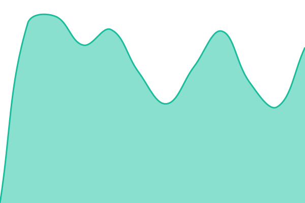
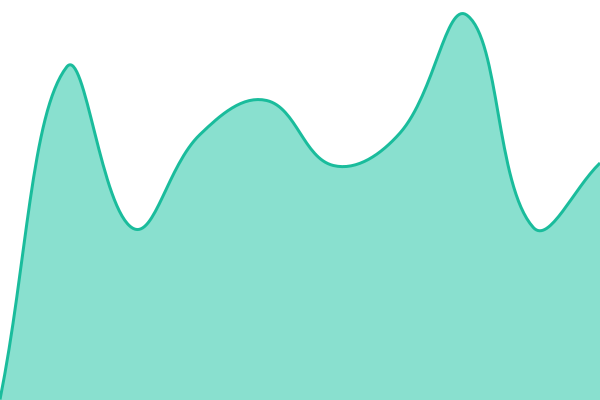

# [📈 Live Status](https://status.codeskraps.com): <!--live status--> **🟧 Partial outage**

This repository contains the open-source uptime monitor and status page for [Carles Sentis](http://codeskraps.com), powered by [Upptime](https://github.com/upptime/upptime).

With [Upptime](https://upptime.js.org), you can get your own unlimited and free uptime monitor and status page, powered entirely by a GitHub repository. We use [Issues](https://github.com/codeskraps/upptime_codeskraps_status/issues) as incident reports, [Actions](https://github.com/codeskraps/upptime_codeskraps_status/actions) as uptime monitors, and [Pages](https://status.codeskraps.com) for the status page.

<!--start: status pages-->
<!-- This summary is generated by Upptime (https://github.com/upptime/upptime) -->
<!-- Do not edit this manually, your changes will be overwritten -->
<!-- prettier-ignore -->
| URL | Status | History | Response Time | Uptime |
| --- | ------ | ------- | ------------- | ------ |
|  [codeskraps.com](https://codeskraps.com) | 🟩 Up | [codeskraps-com.yml](https://github.com/codeskraps/upptime_codeskraps_status/commits/HEAD/history/codeskraps-com.yml) | 

 515ms
     
 | 

<a href="https://status.codeskraps.com/history/codeskraps-com">100.00%</a>
    

|  [Repo](https://repo.codeskraps.com/codeskraps) | 🟩 Up | [repo.yml](https://github.com/codeskraps/upptime_codeskraps_status/commits/HEAD/history/repo.yml) | 

 1073ms
     
 | 

<a href="https://status.codeskraps.com/history/repo">100.00%</a>
    

|  [Vaultwarden](https://vault.codeskraps.com/alive) | 🟩 Up | [vaultwarden.yml](https://github.com/codeskraps/upptime_codeskraps_status/commits/HEAD/history/vaultwarden.yml) | 

 435ms
     
 | 

<a href="https://status.codeskraps.com/history/vaultwarden">100.00%</a>
    

|  [Taxchain](https://taxchain.codeskraps.com) | 🟩 Up | [taxchain.yml](https://github.com/codeskraps/upptime_codeskraps_status/commits/HEAD/history/taxchain.yml) | 

 1042ms
     
 | 

<a href="https://status.codeskraps.com/history/taxchain">100.00%</a>
    

|  [GlitchTip](https://crash.codeskraps.com) | 🟩 Up | [glitch-tip.yml](https://github.com/codeskraps/upptime_codeskraps_status/commits/HEAD/history/glitch-tip.yml) | 

 563ms
     
 | 

<a href="https://status.codeskraps.com/history/glitch-tip">100.00%</a>
    

|  [Umami Dashboard](https://umami.codeskraps.com/dashboard) | 🟩 Up | [umami-dashboard.yml](https://github.com/codeskraps/upptime_codeskraps_status/commits/HEAD/history/umami-dashboard.yml) | 

 580ms
     
 | 

<a href="https://status.codeskraps.com/history/umami-dashboard">100.00%</a>
    

|  [Beszel](https://watch.codeskraps.com) | 🟩 Up | [beszel.yml](https://github.com/codeskraps/upptime_codeskraps_status/commits/HEAD/history/beszel.yml) | 

 452ms
     
 | 

<a href="https://status.codeskraps.com/history/beszel">100.00%</a>
    

|  [ops dashboard](https://ops.codeskraps.com/healthz) | 🟩 Up | [ops-dashboard.yml](https://github.com/codeskraps/upptime_codeskraps_status/commits/HEAD/history/ops-dashboard.yml) | 

 426ms
     
 | 

<a href="https://status.codeskraps.com/history/ops-dashboard">100.00%</a>
    

|  [TREK](https://trek.codeskraps.com/api/health) | 🟩 Up | [trek.yml](https://github.com/codeskraps/upptime_codeskraps_status/commits/HEAD/history/trek.yml) | 

 438ms
     
 | 

<a href="https://status.codeskraps.com/history/trek">100.00%</a>
    

|  [Tracks](https://tracks.codeskraps.com) | 🟩 Up | [tracks.yml](https://github.com/codeskraps/upptime_codeskraps_status/commits/HEAD/history/tracks.yml) | 

 857ms
     
 | 

<a href="https://status.codeskraps.com/history/tracks">100.00%</a>
    

|  [PrivateBin](https://paste.codeskraps.com) | 🟩 Up | [private-bin.yml](https://github.com/codeskraps/upptime_codeskraps_status/commits/HEAD/history/private-bin.yml) | 

 553ms
     
 | 

<a href="https://status.codeskraps.com/history/private-bin">100.00%</a>
    

|  [Gokapi](https://share.codeskraps.com) | 🟩 Up | [gokapi.yml](https://github.com/codeskraps/upptime_codeskraps_status/commits/HEAD/history/gokapi.yml) | 

 464ms
     
 | 

<a href="https://status.codeskraps.com/history/gokapi">100.00%</a>
    

|  [Chhoto URL](https://short.codeskraps.com) | 🟩 Up | [chhoto-url.yml](https://github.com/codeskraps/upptime_codeskraps_status/commits/HEAD/history/chhoto-url.yml) | 

 456ms
     
 | 

<a href="https://status.codeskraps.com/history/chhoto-url">100.00%</a>
    

|  [Clock-in](https://clock.codeskraps.com) | 🟩 Up | [clock-in.yml](https://github.com/codeskraps/upptime_codeskraps_status/commits/HEAD/history/clock-in.yml) | 

 815ms
     
 | 

<a href="https://status.codeskraps.com/history/clock-in">100.00%</a>
    

|  [Copytrade](https://copy.codeskraps.com) | 🟩 Up | [copytrade.yml](https://github.com/codeskraps/upptime_codeskraps_status/commits/HEAD/history/copytrade.yml) | 

 1054ms
     
 | 

<a href="https://status.codeskraps.com/history/copytrade">100.00%</a>
    

|  [FreqDroid](https://freqdroid.com) | 🟩 Up | [freq-droid.yml](https://github.com/codeskraps/upptime_codeskraps_status/commits/HEAD/history/freq-droid.yml) | 

 571ms
     
 | 

<a href="https://status.codeskraps.com/history/freq-droid">100.00%</a>
    

|  [FreqDroid Push](https://push.freqdroid.com/health) | 🟩 Up | [freq-droid-push.yml](https://github.com/codeskraps/upptime_codeskraps_status/commits/HEAD/history/freq-droid-push.yml) | 

 439ms
     
 | 

<a href="https://status.codeskraps.com/history/freq-droid-push">100.00%</a>
    

|  [La vida amb vosaltres](https://lavidaambvosaltres.com) | 🟩 Up | [la-vida-amb-vosaltres.yml](https://github.com/codeskraps/upptime_codeskraps_status/commits/HEAD/history/la-vida-amb-vosaltres.yml) | 

 481ms
     
 | 

<a href="https://status.codeskraps.com/history/la-vida-amb-vosaltres">100.00%</a>
    

|  [Hyprr](https://hyprr.cat) | 🟩 Up | [hyprr.yml](https://github.com/codeskraps/upptime_codeskraps_status/commits/HEAD/history/hyprr.yml) | 

 665ms
     
 | 

<a href="https://status.codeskraps.com/history/hyprr">100.00%</a>
    

|  [Jellyfin Escolt](https://escolt.eu) | 🟩 Up | [jellyfin-escolt.yml](https://github.com/codeskraps/upptime_codeskraps_status/commits/HEAD/history/jellyfin-escolt.yml) | 

 1177ms
     
 | 

<a href="https://status.codeskraps.com/history/jellyfin-escolt">100.00%</a>
    

|  [Jellyfin TV Escolt](https://tv.escolt.eu) | 🟩 Up | [jellyfin-tv-escolt.yml](https://github.com/codeskraps/upptime_codeskraps_status/commits/HEAD/history/jellyfin-tv-escolt.yml) | 

 1008ms
     
 | 

<a href="https://status.codeskraps.com/history/jellyfin-tv-escolt">100.00%</a>
    

|  [LibrePhotos Escolt](https://photos.escolt.eu) | 🟥 Down | [libre-photos-escolt.yml](https://github.com/codeskraps/upptime_codeskraps_status/commits/HEAD/history/libre-photos-escolt.yml) | 

 531ms
     
 | 

<a href="https://status.codeskraps.com/history/libre-photos-escolt">100.00%</a>
    

<!--end: status pages-->

[**Visit our status website →**](https://status.codeskraps.com)

## 📄 License

- Powered by: [Upptime](https://github.com/upptime/upptime)
- Code: [MIT](./LICENSE) © [Anand Chowdhary](https://anandchowdhary.com), supported by [Pabio](https://pabio.com)
- Data in the `./history` directory: [Open Database License](https://opendatacommons.org/licenses/odbl/1-0/)
